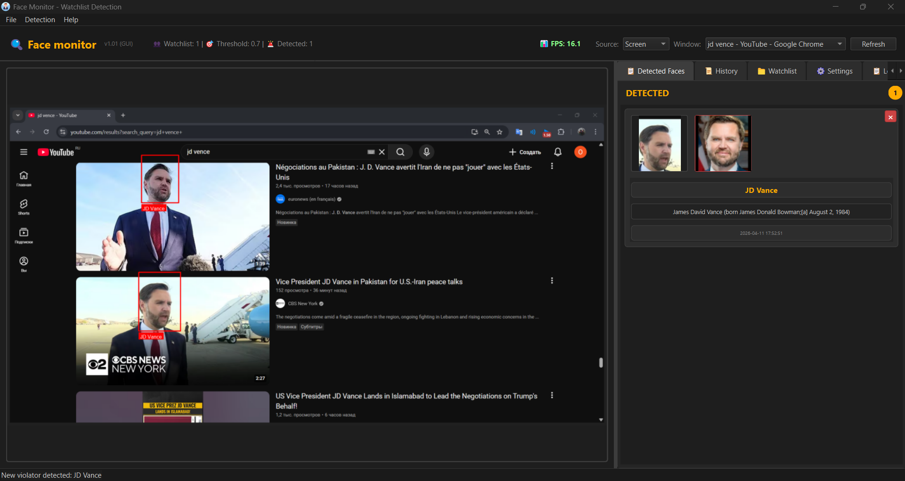

# Face Monitor

Face Monitor is a desktop application for real-time face detection and watchlist matching.
It uses OpenCV + DeepFace for recognition and PySide6 for the GUI.

## 📸 Screenshots

### Main Application Window



## Features

- Real-time face detection from camera/screen/video stream
- Watchlist-based face matching
- Automatic save of detected face snapshots
- Detection history with image preview
- Local SQLite history storage
- Basic settings persistence in `settings.json`

## Project Structure

- `app/launcher.py` - app entry point for module launch
- `app/main_window.py` - main window and app orchestration
- `app/recognition/processor.py` - detection and recognition pipeline (`FaceProcessor`)
- `app/video/thread.py` - frame capture/processing thread (`VideoThread`)
- `app/ui/` - UI panels and widgets (`history_panel.py`, `watchlist_panel.py`, etc.)
- `app/storage/db.py` - SQLite operations for detections/history
- `app/storage/files.py` - file I/O helpers
- `watchlist/` - known faces (supports nested folders)
- `detections/` - saved detection snapshots
- `detections.db` - local detection database

## Requirements

- Windows (recommended for current scripts)
- Python 3.12
- `pip`

Dependencies are listed in `app/requirements.txt`.

## Quick Install (Windows)

Run the installer script from the project root:

```powershell
.\clear_and_install.bat
```

This script:
- creates a fresh `venv`
- installs all required packages
- sets `TF_USE_LEGACY_KERAS=1`
- generates helper launch scripts

## Run

### Option 1: Batch launcher (recommended on Windows)

```powershell
.\launcher.bat
```

### Option 2: Python module

```powershell
.\venv\Scripts\python -m app.launcher
```

### Option 3: Direct script (if your environment is already active)

```powershell
python -m app.launcher
```

## Data and Configuration

- App settings: `settings.json`
- Detection images: `detections/`
- Detection history DB: `detections.db`
- Watchlist images: `watchlist/`

## Notes

- For best recognition quality, use clear front-facing watchlist photos.
- If TensorFlow/DeepFace import issues appear, verify that `TF_USE_LEGACY_KERAS=1` is set.
- If startup fails, run `diagnostic.bat` (created by installer) to check environment health.

## Troubleshooting

- `Repository not found` on git push: verify `origin` URL and GitHub account permissions.
- Missing detections/history updates: check write permissions for `detections/` and `detections.db`.
- Camera/screen source issues: verify source settings in the app and confirm device availability.

